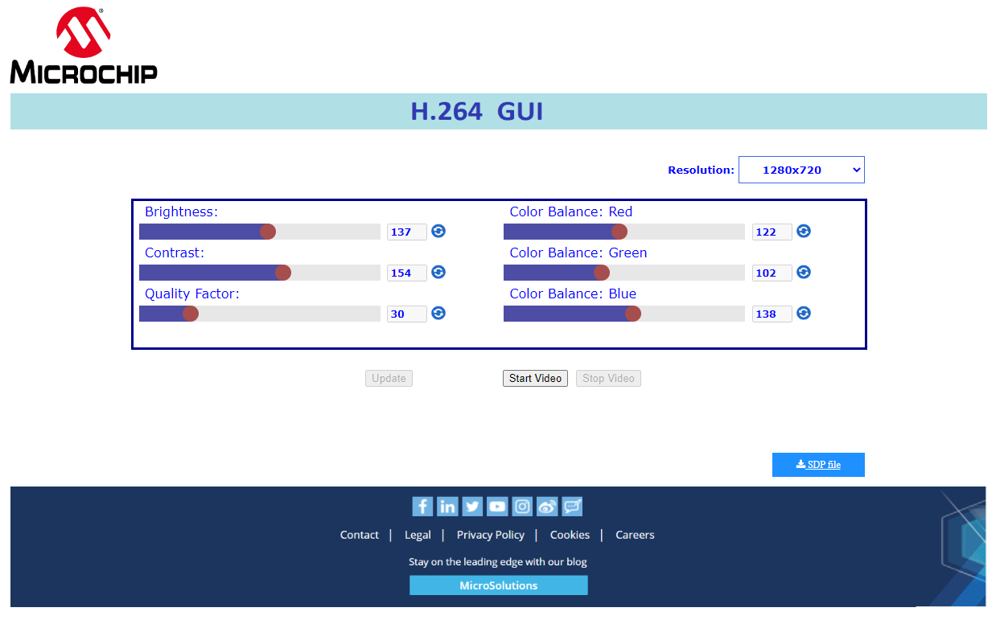
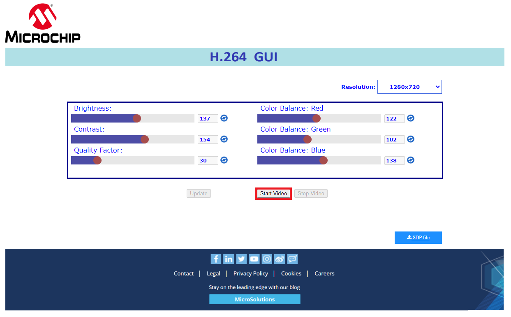
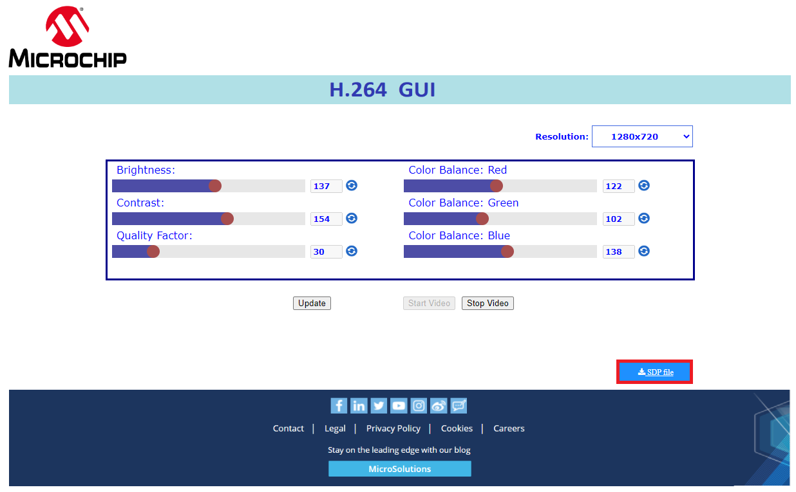
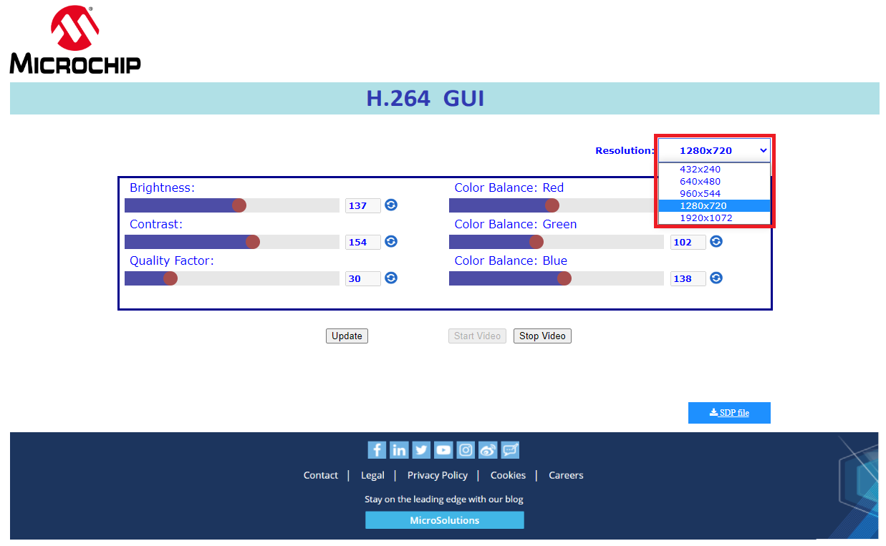
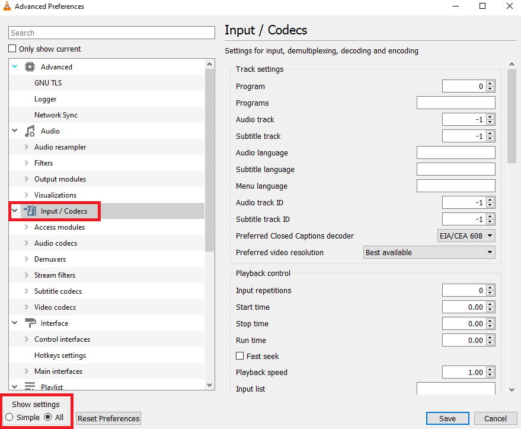
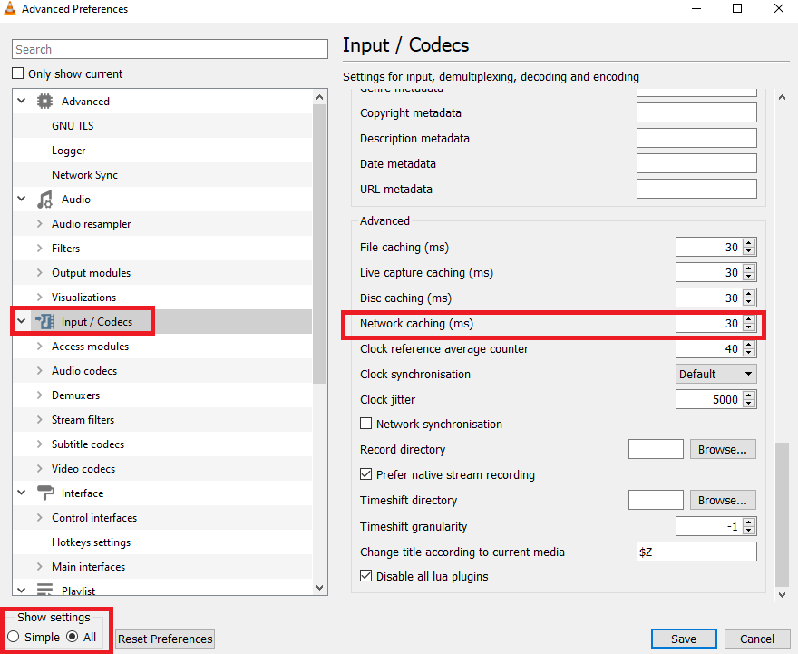
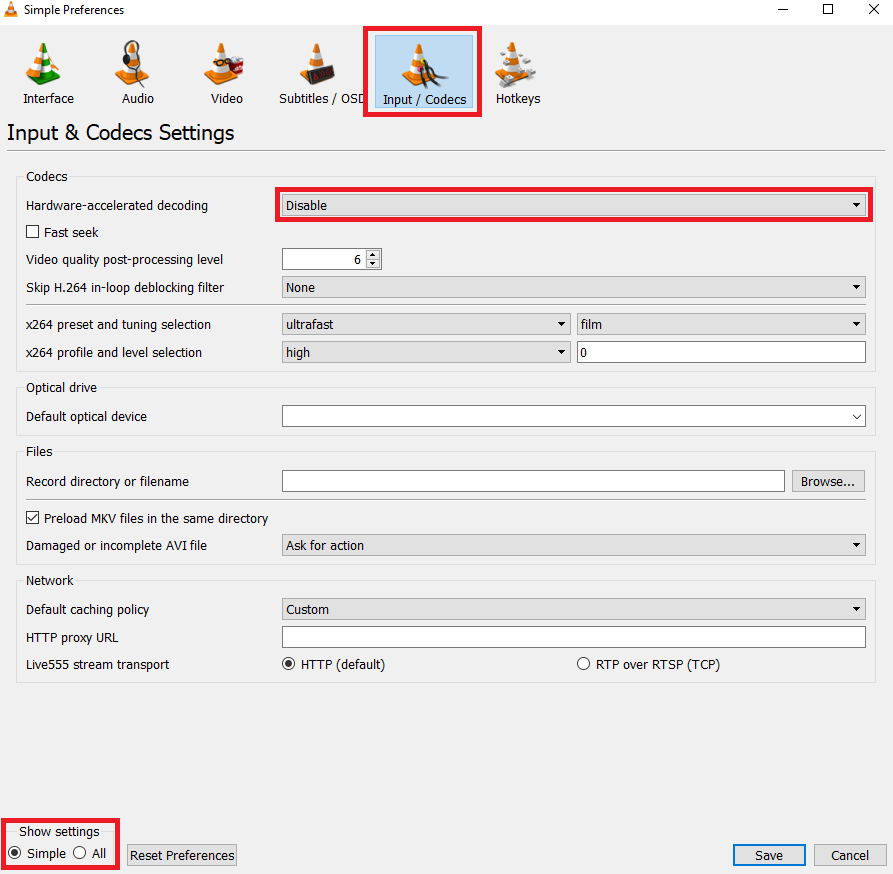
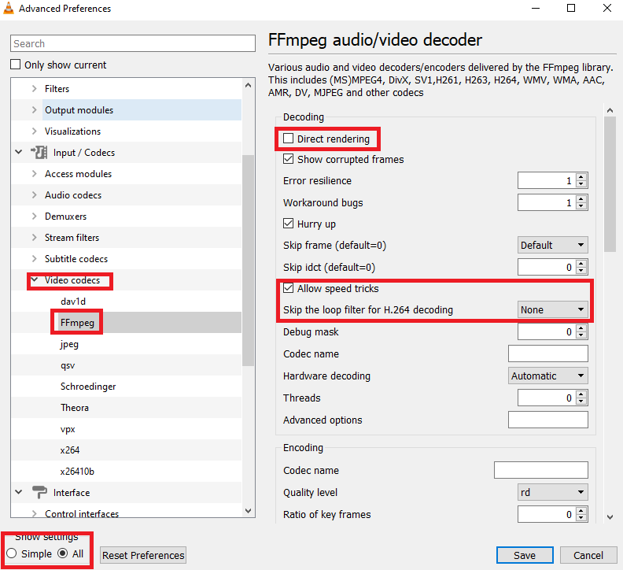
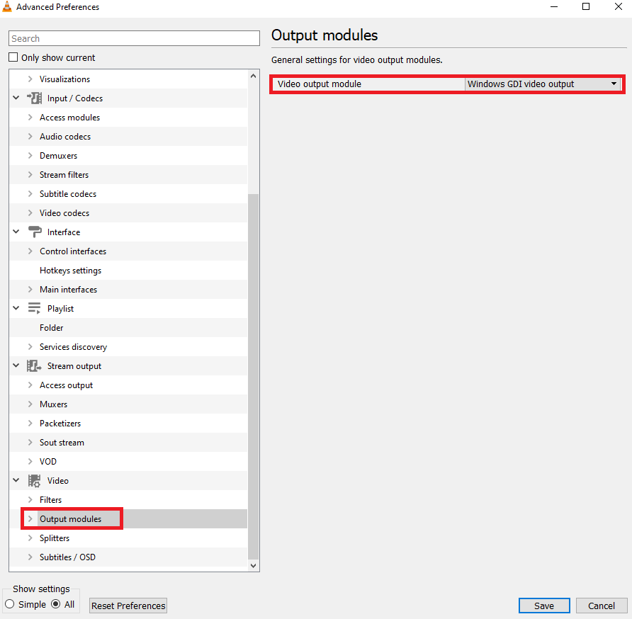

# MPFS SEV Kit H.264 Demo

## Table of Contents

- [MPFS SEV Kit H.264 Demo](#mpfs-sev-kit-h.264-demo)
  - [Table of Contents](#table-of-contents)
  - [Description](#description)
  - [Hardware set up](#hardware-set-up)
  - [VLC configurations](#vlc-configurations)
    - [Alter How Much VLC Caches the Video](#alter-how-much-vlc-caches-the-video)
    - [Configuration of FFMPEG video  decoder parameters](#configuration-of-ffmpeg-video-decoder-parameters)
    - [Configuration of Video output module to the Windows GDI output module](#configuration-of-video-output-module-to-the-windows-gdi-output-module)

## Description

This demo guide describes how to run H.264 video streaming over ethernet demo using Microchip’s PolarFire SoC SEV Kit.
This kit features an MFS250T PolarFire SoC device. Microchip's PolarFire SoC devices combine RISC-V based 5x core Microprocessor Subsystem (MSS) capable of running Linux and the PolarFire FPGA Fabric in a single device.
This powerful combination enables the partitioning of user designs between the MSS (application code) and the fabric (HDL).
Microchip's Libero SoC enables the rapid development of RTL based designs for PolarFire SoC and many other device families.
Libero SoC provides a wide range of IP for a variety of applications such as video and imaging, signal processing, wired and wireless communications, and networking.
Microchip's SoftConsole enables the rapid development of C/C++ source code based applications targeted for all Microchip FPGA and SoC device families.

The demo captures live stream from a camera on a PolarFire SoC SEV kit and performs H.264 compression using the FPGA fabric logic. A webserver application running on the MSS allows user to connect to the PolarFire SoC SEV kit via ethernet.
Users can view the webserver by entering the IP address of the kit in a web browser. The webpage on the browser allows the user to control streaming of the live video from the SEV kit to the connected system.
After the user initiates the stream on the webpage, the application running on the MSS reads a compressed stream of data from the fabric and sends encoded H.264 RTP ethernet packets to the IP address of the system which initiated the stream.
Users can play the video stream on a computer using applications such as VLC Media Player, Gstreamer or FFPlay. The webpage allows users to download an SDP file that can be passed on to the video player (VLC, Gstreamer, FFplay) after streaming is initiated.

The kit comes preprogrammed with a demonstrative design to run the PolarFire SoC H.264 demo. When you want to update your SEV kit to the latest releases of the reference Libero design and the software, refer to the [Updating MPFS Kit](https://mi-v-ecosystem.github.io/redirects/boards-mpfs-generic-updating-mpfs-kit).
The latest reference Libero design for SEV kit is available at [SEV Kit Reference Design](https://mi-v-ecosystem.github.io/redirects/repo-sev-kit-reference-design). The latest Linux images for the SEV Kit are available from the releases section of the [Meta PolarFire SoC Yocto BSP](https://mi-v-ecosystem.github.io/redirects/releases-meta-polarfire-soc-yocto-bsp) repository. For the jumper settings and other board details for the SEV Kit, refer to the [SEV Kit user's guide](https://mi-v-ecosystem.github.io/redirects/boards-mpfs-sev-kit-sev-kit-user-guide).

Before you get started, the following items required to set up and run the demo.

- HostPC/Laptop – Windows 10 and above / Ubuntu 20.04
- VLC Media Player – 3.0.16 (Windows) and above / VLC Media Player – 3.0.9.2 (Ubuntu) and above.
- Web Browser – Chrome 96.0.4664.110 (Official Build) (64-bit) and above or Microsoft Edge Version 96.0.1054.53 (Official build) (64-bit) and above

### Hardware set up

1. Insert the dual camera sensor module into J10 on the PolarFire SoC SEV kit. Ensure the lens caps are removed from the cameras.
2. By default the SEV kit is programmed in DHCP mode, if you connect RJ45 ethernet cable between any one of the ethernet ports (connector J6 or J7) on the board and your network switch/router, SEV kit will get a DHCP IP address and you can power on the kit and skip to step 10.
3. For static IP address mode follow the below steps
4. Power ON the board by sliding SW5 to the ON position and wait for the system boot sequence to complete.
5. Eth0 configuration: Open /etc/systemd/network/60-static-eth0.network.

   ```text
   root@sev-kit-es:~# vim /etc/systemd/network/60-static-eth0.network
   ```

   Comment out DHCP support, line 6, and uncomment the static IP configuration as shown below:

   ```text
   [Match]
   # You can also use wildcards. Maybe you want enable dhcp
   # an all eth* NICs
   Name=eth0
   [Network]
   #DHCP=v4
   # static IP
   192.168.100.2 netmask 255.255.255.0
   Address=192.168.2.1/24
   Gateway=192.168.2.254
   DNS=8.8.8.8
   ```

   Eth1 configuration: Open /etc/systemd/network/70-static-eth1.network.

   ```text
   root@sev-kit-es:~# vim /etc/systemd/network/70-static-eth1.network
   ```

   Comment out DHCP support, line 6, and uncomment the static IP configuration as shown below:

   ```text
   [Match]
   #You can also use wildcards. Maybe you want enable dhcp
   #an all eth* NICs
   Name=eth1
   [Network]
   #DHCP=v4
   #static IP
   192.168.100.2 netmask 255.255.255.0
   Address=192.168.2.2/24
   Gateway=192.168.2.254
   DNS=8.8.8.8
   ```

6. Now power off the board by sliding SW5 to the OFF position and connect an RJ45 ethernet cable between any one of the ethernet ports (connector J6 or J7) on the board and your Host PC.
7. Power ON the board by sliding SW5 to the ON position and wait for the system boot sequence to complete.
8. Default static IP address of the board is (eth0 J6) 192.168.2.1 and (eth1 J7) 192.168.2.2 based on the interface (depends on the GEM port you connected to). Ensure that host PC is in the same network (192.168.2.X).
9. From the Host PC open the browser (Chrome). Enter the IP address of the PolarFire SoC SEV kit (192.1682.1 or 192.168.2.2 or the IP address assigned by DHCP) in the address bar.
10. The H.264 demo GUI will load automatically as shown in the image below:

 
11. Click the "Start Video" button as shown and follow the below steps:

 
12. Click on "download SDP file" button to download SDP file.

 
13. Open SDP file:

- Windows: Open the SDP file with the VLC Media Player to play the video stream.
- Linux: Open the SDP file with the GUI of VLC Media Player, OR "execute the vlc command" in the terminal, passing the SDP file as an argument "e.g. vlc video.sdp"
- You should be able to observe a livestream video. This is a scaled & H.264 compressed video of the selected resolution. To change the resolution, select the resolution as shown below and click "update" button.



### VLC configuration

#### Alter How Much VLC Caches the Video

First,

1. Open VLC’s preferences by going to Tools > Preferences.
2. Click “All” under the “Show Settings” option at the bottom of the window.
3. Click “Input / Codecs” in the left sidebar.

 

- The standard delay in VLC for "Network Caching (ms)" is 1000 ms. This will cause noticeable lag, in order to avoid it reduce the caching value to 30 ms.

 
4. Select "Disable" for "Hardware-accelerated decoding" as it not supported by the SEV kit.

From the Preferences panel, click “Simple” in the lower left-hand corner, then, go to to Input/Codecs. Click the “Hardware-accelerated decoding” dropdown and choose Disable it.

 

#### Configuration of FFMPEG video decoder parameters

1. Open the preferences panel by selecting "Tools" > "Preferences"
2. Select “All” under the “Show Settings” option at the bottom of the window.

 
3. Select “Input/Codecs" -> "Video codecs"-> "FFMPEG”
4. Uncheck "Direct rendering"
5. Allow the speed tricks to None
6. "Threads" should be 2
7. Click "Save"

#### Configuration of Video output module to the Windows GDI output module

1. Open VLC’s preferences by going to Tools > Preferences.
2. Then, click “All” under the “Show Settings” option at the bottom of the window.
3. Click as video output modules as windows GDI video output in the left sidebar.
4. Click "Save".


